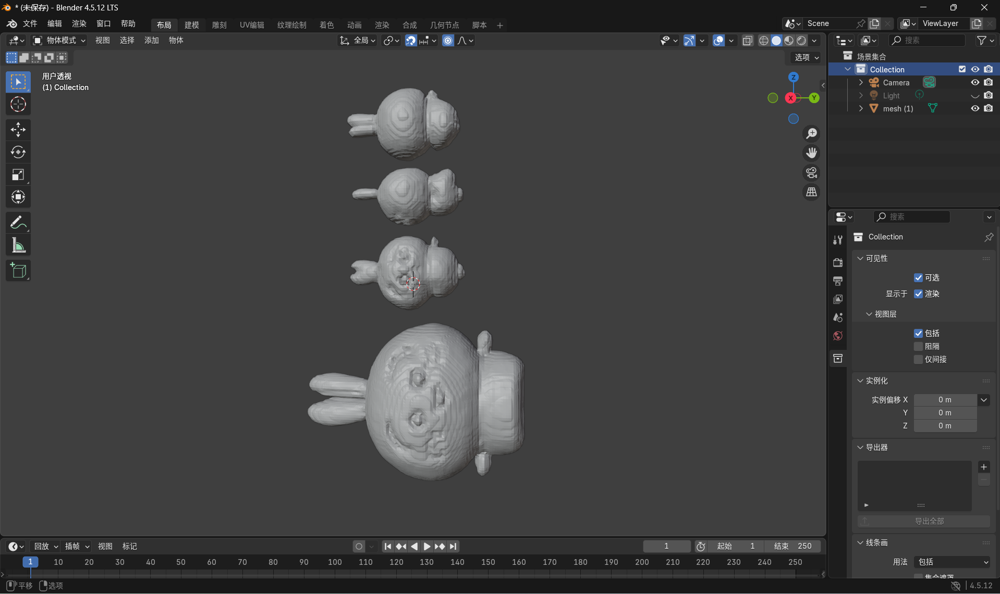

# TripoSR Image-to-3D Reproduction

> A reproducible single-image 3D reconstruction pipeline, validated end to end
> on Google Colab and Blender.

[](https://www.python.org/)
[](https://pytorch.org/)
[](TripoSR_Colab.ipynb)
[](LICENSE)

This project reproduces and hardens the inference workflow of
[TripoSR](https://github.com/VAST-AI-Research/TripoSR), an open-source model
for reconstructing a 3D mesh from a single RGB image. It covers environment
setup, dependency compatibility, image preprocessing, GPU inference, mesh
extraction, OBJ export, and Blender verification.

## Result



The screenshot above is a mesh generated from a user-provided image and opened
successfully in Blender 4.5 LTS. Because the input contained several objects,
the model reconstructed them as a single scene. This also demonstrates a key
limitation of single-view reconstruction: clean, single-object inputs produce
the best results.

## Highlights

- Reproduced the complete image-to-OBJ pipeline on an NVIDIA Tesla T4.
- Resolved incompatibilities between pretrained weights and newer
  `transformers` releases by pinning the validated dependency set.
- Added a CPU marching-cubes fallback for environments where `torchmcubes`
  cannot be compiled with CUDA support.
- Built a reusable Colab notebook for GPU setup, image upload, inference, and
  result download.
- Verified generated geometry in Blender and documented input-quality limits.
- Excluded checkpoints, datasets, personal links, and generated artifacts from
  version control.

## Measured performance

| Stage | Environment | Observed time |
| --- | --- | ---: |
| Model initialization | Tesla T4, Colab | ~8 s |
| Image-to-scene inference | Tesla T4, Colab | ~2 s |
| Mesh extraction, resolution 256 | Tesla T4, Colab | ~3 s |
| OBJ export | Tesla T4, Colab | <1 s |

Times are measurements from the verified run and vary by runtime and input.
Background removal can take longer than model inference on the first run.

## Pipeline

```text
Input image
    ↓
Background removal and foreground normalization
    ↓
DINO image encoding
    ↓
Triplane reconstruction network
    ↓
NeRF density and color field
    ↓
Marching cubes mesh extraction
    ↓
OBJ / GLB export → Blender
```

## Quick start

### Google Colab

Open [`TripoSR_Colab.ipynb`](TripoSR_Colab.ipynb), select a GPU runtime, set
the private project ZIP URL in the marked cell, and run the cells in order.
The notebook contains no personal Google Drive URL or file identifier.

### Local environment

Python 3.10 or 3.11 and an NVIDIA GPU with at least 6 GB VRAM are recommended.

```bash
python -m venv .venv
# Windows: .venv\Scripts\activate
# Linux/macOS: source .venv/bin/activate
pip install --upgrade "setuptools<82" wheel
pip install -r requirements.txt
python run.py examples/chair.png --output-dir output/
```

Texture-atlas export:

```bash
python run.py examples/chair.png --output-dir output/ --bake-texture
```

Local interactive interface:

```bash
python gradio_app.py
```

## Project structure

```text
.
├── TripoSR_Colab.ipynb     # Reproducible GPU workflow
├── run.py                  # Command-line inference entry point
├── gradio_app.py           # Interactive web interface
├── tsr/                    # Model, renderer, and mesh extraction code
├── examples/               # Sample inputs
├── figures/                # Reference visualizations
├── docs/                   # Verification images
└── requirements.txt        # Validated dependency versions
```

Large checkpoints, datasets, generated meshes, and local outputs are excluded
from Git. They must be downloaded or generated separately.

## Limitations

- Geometry on invisible surfaces is inferred rather than observed.
- Multiple objects in one image may be reconstructed into one combined mesh.
- Fine structures, transparent materials, and heavy occlusion remain difficult.
- Output quality depends strongly on segmentation and input framing.

## Credits

This is an engineering reproduction, not a claim of authorship of the TripoSR
model. TripoSR was developed by Tripo AI and Stability AI. The original code
and model are released under the MIT License. See [LICENSE](LICENSE) and the
[official repository](https://github.com/VAST-AI-Research/TripoSR).
